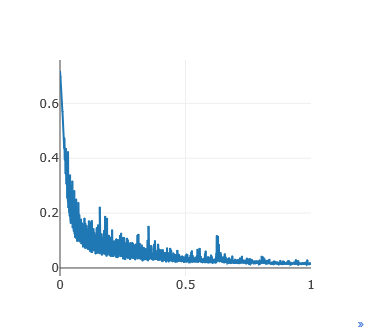
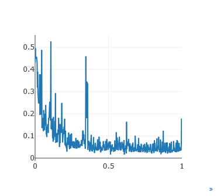
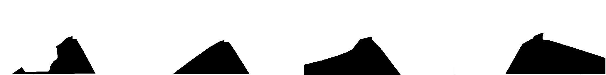
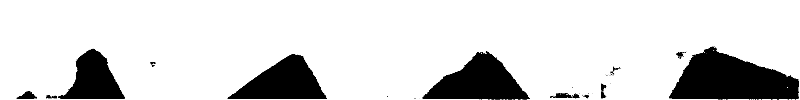

# Road Segmentation
Models of semantic segmentation applied in KITTI road dataset. I use SD-Filter for LiDAR upsampling.

## Iteration details

| **Loss** | Train Loss                  | Test Loss                  |
| ---------- | -------------------------------------- | ---------------------------------- |
| ****   |  |  |

| **Result** | Origin Images                  | Predict Images                  |
| ---------- | -------------------------------------- | ---------------------------------- |
| ****   |  |  |

## Models Comparison

| **Model** | FCNxs    | Late-fusion FCN(minus)     |  cross-fusion FCN(cat)    | Cross-fusion FCN(2 layers' cross-plus) | cross-fusion FCN(all layers' cross-plus)    | PSPNet |
| ---------- | ------------------ | ---------------- | ---------------- | ---------------- | ---------------- | ---------------- |
| **MaxF**   | 95.05 | 94.94 | 95.78 | 95.58 | 93.79 | 97.97 |
| **AvgPrec**   | 89.95 | 90.36 | 90.06 | 88.93 | 88.24 | 90.60 |